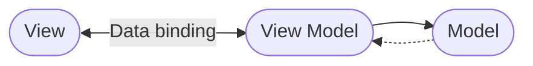

# Part 2 - Architecture

We will be making use of the MVVM pattern which is widely used in .NET MAUI applications.

Model View ViewModel is a software design pattern that focuses on separating the user interface (View) from the business logic (Model), it achieves this with the use of a layer in between (ViewModel). MVVM allows a clean separation of presentation and business logic.

## More links and resources

It is worth stating that while MVVM is the most common pattern used within .NET MAUI applications, it doesn't mean that you have to use it. Below are some links to alternative options to the traditional MVVM approach.

* [Reactive](https://www.reactiveui.net)
* [MVU](https://github.com/adospace/reactorui-maui)
* [C# Markup](https://github.com/CommunityToolkit/Maui.Markup)